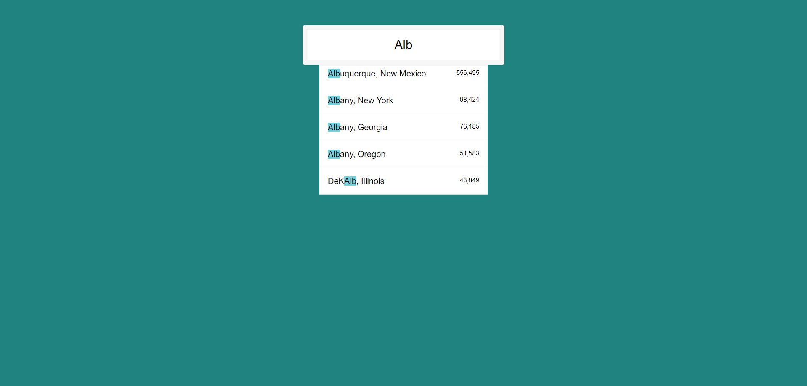

# Ajax Drop Down

## Overview

This project demonstrates how to **implement an AJAX-powered dropdown menu** that displays city and state suggestions as the user types. The goal of this project was to practice **fetching data using AJAX** and dynamically filtering it based on user input.

## Key Features

- **AJAX Data Fetching**: The project fetches data asynchronously from an external JSON file using the `fetch()` API.
- **Dynamic Filtering**: The cities and states are filtered based on the user’s input, and matching results are shown in real-time.
- **Regex Highlighting**: The matched portion of the city or state name is highlighted using a regular expression.
- **Population Formatting**: City populations are formatted with commas to improve readability.



## How It Works

### Fetching Data

The project fetches a JSON file containing U.S. cities and their populations from an external endpoint using the `fetch()` API. This data is stored in an array, and JavaScript is used to filter and display the relevant cities or states as the user types.

```javascript
const endpoint =
  "https://gist.githubusercontent.com/Miserlou/c5cd8364bf9b2420bb29/raw/2bf258763cdddd704f8ffd3ea9a3e81d25e2c6f6/cities.json";
const cities = [];
fetch(endpoint)
  .then((data) => data.json())
  .then((arr) => cities.push(...arr));
```

### Filtering Data

The `findSearch()` function filters cities or states that match the user's input using a **regular expression**. The regular expression is set to match the input in a **case-insensitive** manner (`"gi"` flags).

```javascript
function findSearch(search, cities) {
  return cities.filter((place) => {
    const regex = new RegExp(search, "gi");
    return place.city.match(regex) || place.state.match(regex);
  });
}
```

### Displaying Results

Once a match is found, the results are dynamically displayed in an unordered list (`<ul>`). The matched search term is highlighted within the city or state name using the `<span>` tag with a class of `"hl"` for styling.

```javascript
function displayMatches() {
  const matchArray = findSearch(this.value, cities);
  const html = matchArray
    .map((place) => {
      const regex = new RegExp(this.value, "gi");
      const cityName = place.city.replace(
        regex,
        `<span class="hl">${this.value}</span>`
      );
      const stateName = place.state.replace(
        regex,
        `<span class="hl">${this.value}</span>`
      );
      return `
        <li>
            <span class="name">${cityName}, ${stateName}</span>
            <span class="population">${formatNumber(place.population)}</span>
        </li>
      `;
    })
    .join("");
  suggestions.innerHTML = html;
}
```

### Formatting Numbers

The `formatNumber()` function ensures the population numbers are formatted with commas for readability, converting large numbers into a more user-friendly format.

```javascript
function formatNumber(num) {
  return num.toString().replace(/\B(?=(\d{3})+(?!\d))/g, ",");
}
```

### Event Listeners

The project listens for both the `change` and `keyup` events on the input field. These events trigger the `displayMatches()` function, which updates the suggestions list as the user types.

```javascript
const searchInput = document.querySelector(".search");
const suggestions = document.querySelector(".suggestions");

searchInput.addEventListener("change", displayMatches);
searchInput.addEventListener("keyup", displayMatches);
```

## How to Use

1. Type a **city or state name** in the search bar.
2. As you type, the dropdown will suggest matching cities and states.
3. The population of each result will be displayed, formatted with commas for clarity.

## Technologies Used

- **HTML5**: Provides the basic structure of the form and the unordered list for displaying suggestions.
- **CSS**: Used to style the form, the suggestions list, and highlighted text (not included in this readme).
- **JavaScript**: Handles data fetching, filtering, and dynamic DOM updates.

## License

This project is open-source and free to use.
